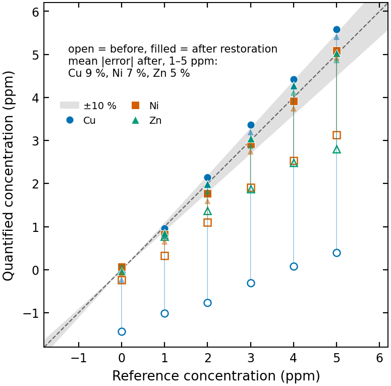
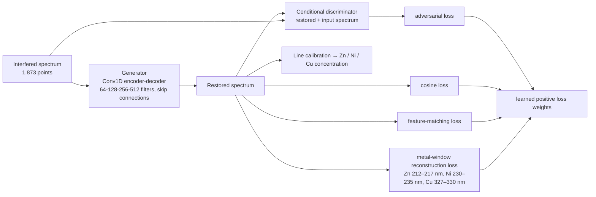
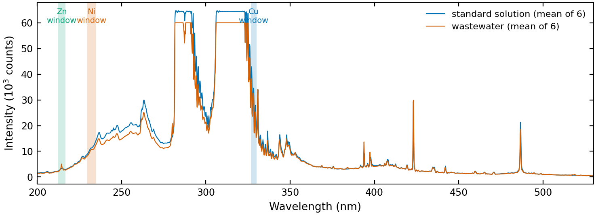

# GAN-Based Restoration of Plasma Spectra for Real-Time Heavy Metal Quantification

[](https://github.com/liangyuchen-research/conditional-gan-spectral-restoration/actions/workflows/checks.yml)

A conditional generative adversarial network that restores plasma emission spectra distorted by matrix interference, so that Zn, Ni and Cu can be quantified from wavelength-specific calibration without retraining for each solution matrix. The repository holds the preprocessing and training notebooks, the model and loss implementation, the calibration and response-correction tools, and the archived evaluation summaries.

Developed at the Plasma Engineering Laboratory, National Taiwan University, with Prof. Cheng-Che Hsu. The companion [plasma-spectroscopy-quantification](https://github.com/liangyuchen-research/plasma-spectroscopy-quantification) repository (published in *Talanta*, 2026) contains the direct concentration-prediction models and the occlusion-based interpretation.

## Result

<p align="center"></p>

*Recorded readouts for 0–5 ppm Zn, Ni and Cu standards under matrix interference: open markers are the calibrated readouts from the raw spectra, filled markers after GAN restoration. Restoration brings the 1–5 ppm readouts to within a mean absolute relative error of 9 % (Cu), 7 % (Ni) and 5 % (Zn). Drawn by `scripts/make_figures.py` from the summary arrays archived in `scripts/plot_correction_error.py`; the matrix-interference and wastewater spike-recovery summaries are archived in the other `scripts/plot_*.py` files.*

## Method



The generator is a strided 1-D convolutional encoder-decoder with skip connections; the discriminator scores the restoration together with its input. Training pairs are built from measured spectra by matching interfered and reference acquisitions and augmenting the metal windows. Everything is implemented in TensorFlow/Keras (`src/spectral_gan.py`) and driven from two notebooks.



*Mean spectra from the two example tables in `data/examples/`, with the three metal windows used by the reconstruction loss shaded. The wastewater matrix changes the continuum and molecular bands that surround the analyte lines.*

## Repository guide

| Location | Purpose |
| --- | --- |
| `notebooks/01_prepare_datasets.ipynb` | Construct paired and augmented spectra and export HDF5 datasets |
| `notebooks/02_train_conditional_gan.ipynb` | Train and evaluate the conditional GAN (3,000 epochs in the preserved configuration) |
| `src/spectral_gan.py` | Generator, discriminator, and the original loss terms |
| `scripts/calibrate_metal_concentrations.py` | Reference normalization, background subtraction, and linear calibration |
| `scripts/correct_spectral_response.py` | Spectral alignment and wavelength-dependent response correction |
| `scripts/normalize_by_area.py`, `normalize_by_h_beta.py` | Alternative normalization procedures |
| `scripts/plot_*.py` | Archived calibration, matrix-interference, repeatability, and wastewater summaries |
| `scripts/check_model.py`, `check_calibration.py` | Bounded model and calibration checks |
| `scripts/make_figures.py` | Regenerates the figures on this page |
| `data/examples/` | Two compact measured-spectrum tables (format inspection only) |
| `docs/` | [Data formats](docs/DATA.md), [reproducibility notes](docs/REPRODUCIBILITY.md), [file mapping](docs/FILE_MAPPING.json) |

## Quick start

Python 3.10–3.12, TensorFlow 2.16.2 with legacy Keras (selected automatically by the model module).

```bash
python -m venv .venv && source .venv/bin/activate      # .venv\Scripts\activate on Windows
python -m pip install -r requirements.txt
python scripts/check_model.py                          # build both networks, one optimizer step, weight round-trip
python scripts/check_calibration.py                    # calibration against known slopes
python scripts/make_figures.py                         # regenerate docs/figures/
python -m jupyter lab                                  # preprocessing notebook first, then training
```

Full training needs the paired HDF5 datasets, which are not in this repository (2,376 training pairs of 1,873 points in the archived run). If the research archive is available locally, `python scripts/restore_local_data.py --archive-root <path>` verifies checksums and copies the listed inputs into `data/local/`. Each notebook writes to a fresh directory under `results/`; `SPECTRAL_DATA_DIR` and `SPECTRAL_OUTPUT_DIR` select other locations.

Calibration and plotting scripts run on their own:

```bash
python scripts/calibrate_metal_concentrations.py training.csv testing.csv --output results/calibration-run
python scripts/plot_wastewater_spike_recovery.py
```

## Scope and reproducibility

The preprocessing, model, losses and training settings are preserved unchanged, and the model passes construction, finite forward/optimizer-step and save/reload checks on synthetic spectra; the archived generator weights load and predict. Full training has not been rerun for this public copy, the figures above use recorded summary values rather than a fresh evaluation, and two earlier experiment variants (repeat-measurement and transfer learning) need acquisitions that are not in the supplied archive. Details, including every experimental assumption that affects interpretation, are in the [reproducibility notes](docs/REPRODUCIBILITY.md).

## Data and code use

The [file mapping](docs/FILE_MAPPING.json) links research files to repository paths. Original measurements, executed notebooks and checkpoints remain in the research archive; contact the repository owner regarding reuse or access to the full data.
