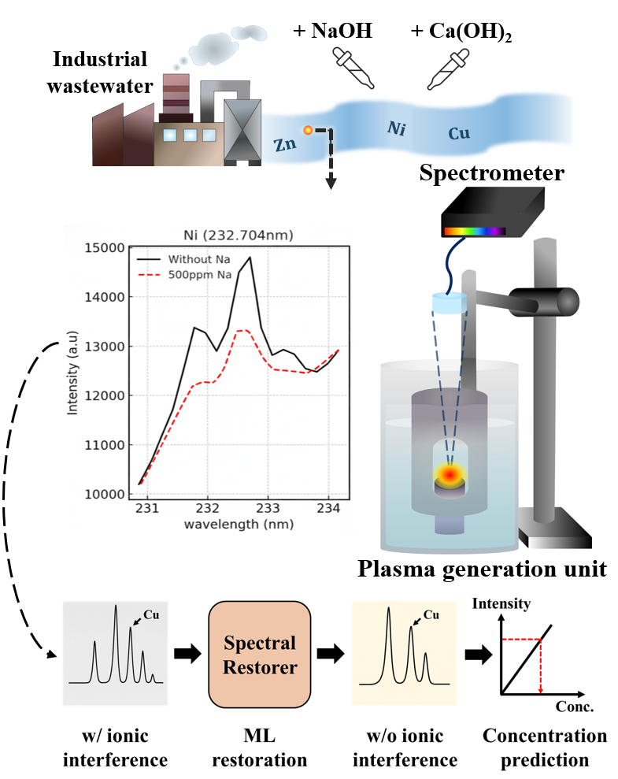
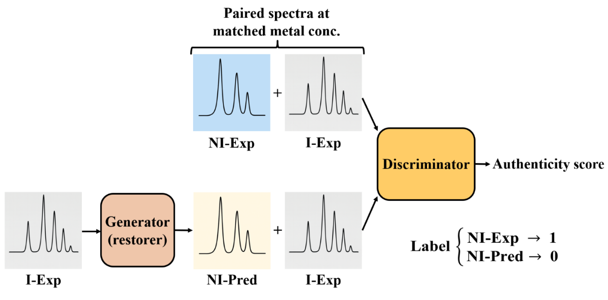
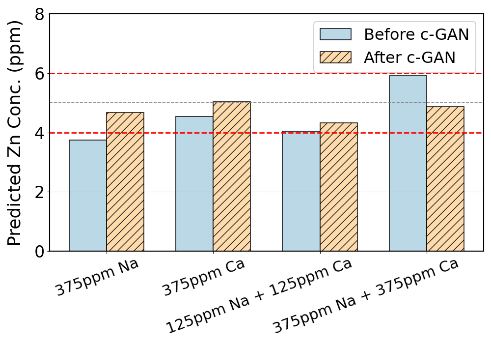
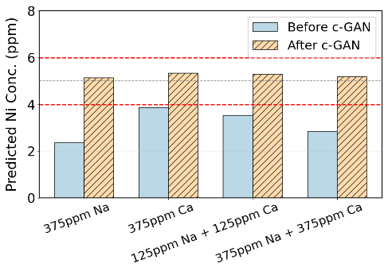
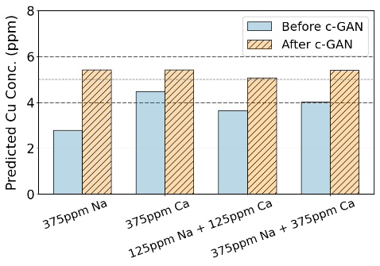
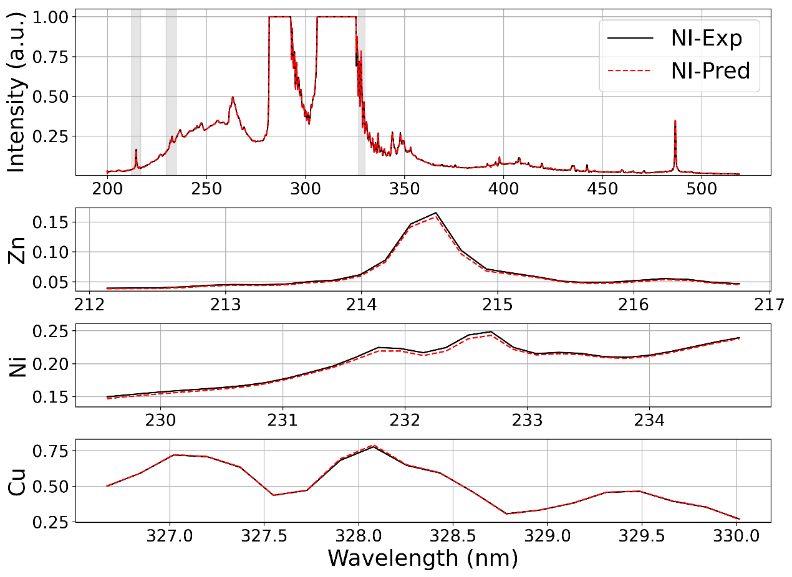
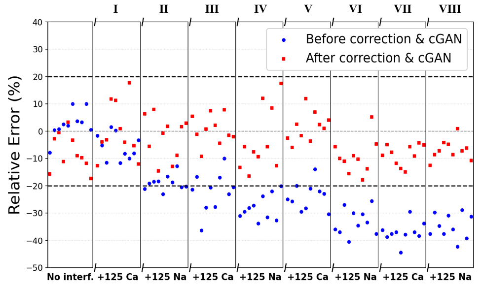

# GAN-Based Restoration of Plasma Spectra for Real-Time Heavy Metal Quantification

[](https://github.com/liangyuchen-research/conditional-gan-spectral-restoration/actions/workflows/checks.yml)

A conditional generative adversarial network (cGAN) restores plasma emission spectra distorted by ionic matrix interference, allowing wavelength-specific calibration curves to quantify Zn, Ni, and Cu across changing solution matrices without retraining for each matrix.

Developed at the Plasma Engineering Laboratory, National Taiwan University, with Prof. Cheng-Che Hsu. The companion [plasma-spectroscopy-quantification](https://github.com/liangyuchen-research/plasma-spectroscopy-quantification) repository contains the direct concentration-prediction models and occlusion-based interpretation published in [*Talanta*, 297 (2026), 128652](https://doi.org/10.1016/j.talanta.2025.128652).

<p align="center">
  
</p>

*Project overview: plasma-in-liquid spectra acquired under ionic interference are restored toward non-interfered spectra before concentration prediction.*

## Model architecture

<p align="center">
  
</p>

*The generator maps an experimentally acquired interfered spectrum (I-Exp) to a restored non-interfered spectrum (NI-Pred). The conditional discriminator distinguishes measured non-interfered spectra (NI-Exp) from restored spectra while receiving the matched I-Exp as context.*

The generator is a strided 1-D convolutional encoder-decoder with skip connections. Training pairs are constructed from measured spectra at matched heavy-metal concentrations, and the loss combines adversarial, cosine-similarity, feature-matching, and metal-window reconstruction terms. The implementation is in TensorFlow/Keras (`src/spectral_gan.py`) and is driven by the preparation and training notebooks.

## Quantitative restoration

<table>
  <tr>
    <td width="33%"></td>
    <td width="33%"></td>
    <td width="33%"></td>
  </tr>
  <tr>
    <td align="center"><b>(a) Zn</b></td>
    <td align="center"><b>(b) Ni</b></td>
    <td align="center"><b>(c) Cu</b></td>
  </tr>
</table>

*Manuscript Figure 7: predicted concentrations for 5 ppm Zn, Ni, and Cu in the held-out testing matrices. The red dashed lines mark the +/-20% range around the 5 ppm reference. Restoration moves all displayed predictions into that range, with the largest corrections occurring for Ni and Cu.*

## Spectral fidelity after correction

<p align="center">
  
</p>

*Manuscript Figure 9(b): after spectral alignment and intensity correction, NI-Pred closely overlaps NI-Exp across the full spectrum and the Zn, Ni, and Cu emission windows for a representative 5 ppm sample under 500 ppm Na and 500 ppm Ca interference.*

## Dynamic matrix performance

<p align="center">
  
</p>

*Manuscript Figure 10(b): Ni prediction errors during stepwise Na/Ca increases. Before correction and restoration, errors become increasingly negative; after preprocessing, correction, and cGAN restoration, the displayed errors remain within +/-20% across the dynamic sequence.*

## Repository guide

| Location | Purpose |
| --- | --- |
| `notebooks/01_prepare_datasets.ipynb` | Construct paired and augmented spectra and export HDF5 datasets |
| `notebooks/02_train_conditional_gan.ipynb` | Train and evaluate the conditional GAN (3,000 epochs in the preserved configuration) |
| `src/spectral_gan.py` | Generator, discriminator, and the original loss terms |
| `scripts/calibrate_metal_concentrations.py` | Reference normalization, background subtraction, and linear calibration |
| `scripts/correct_spectral_response.py` | Spectral alignment and wavelength-dependent response correction |
| `scripts/normalize_by_area.py`, `normalize_by_h_beta.py` | Alternative normalization procedures |
| `scripts/plot_*.py` | Archived calibration, matrix-interference, repeatability, and wastewater analyses |
| `scripts/check_model.py`, `check_calibration.py` | Bounded model and calibration checks |
| `data/examples/` | Two compact measured-spectrum tables for format inspection |
| `docs/` | [Data formats](docs/DATA.md), [reproducibility notes](docs/REPRODUCIBILITY.md), and [file mapping](docs/FILE_MAPPING.json) |

## Quick start

Python 3.10-3.12 and TensorFlow 2.16.2 with legacy Keras (selected automatically by the model module) are supported.

```bash
python -m venv .venv && source .venv/bin/activate      # .venv\Scripts\activate on Windows
python -m pip install -r requirements.txt
python scripts/check_model.py                          # network build, one optimizer step, weight round-trip
python scripts/check_calibration.py                    # calibration against known slopes
python -m jupyter lab                                  # run preparation before training
```

Full training requires the paired HDF5 datasets, which are not included in the public repository (2,376 training pairs of 1,873 points in the archived run). If the research archive is available locally, `python scripts/restore_local_data.py --archive-root <path>` verifies checksums and copies the listed inputs into `data/local/`. Each notebook writes to a fresh directory under `results/`; `SPECTRAL_DATA_DIR` and `SPECTRAL_OUTPUT_DIR` select other locations.

Calibration and archived analysis scripts can also run independently:

```bash
python scripts/calibrate_metal_concentrations.py training.csv testing.csv --output results/calibration-run
python scripts/plot_wastewater_spike_recovery.py
```

## Scope and reproducibility

The preprocessing, model, losses, and training settings are preserved unchanged. The model passes construction, finite forward/optimizer-step, and save/reload checks on synthetic spectra; the archived generator weights load and predict. Full training has not been rerun for this public copy. The figures presented above are manuscript figures exported from the research paper and are not generated by the bounded quick-start checks. Two earlier experiment variants (repeat measurement and transfer learning) require acquisitions that are not included in the supplied archive.

Details, including the experimental assumptions that affect interpretation, are in the [reproducibility notes](docs/REPRODUCIBILITY.md).

## Data and code use

The [file mapping](docs/FILE_MAPPING.json) links research files to repository paths. Original measurements, executed notebooks, and checkpoints remain in the research archive; contact the repository owner regarding reuse or access to the full data.
